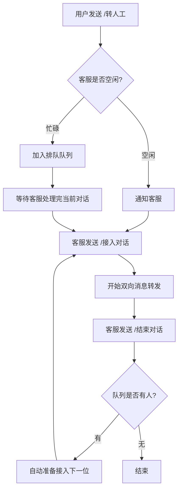
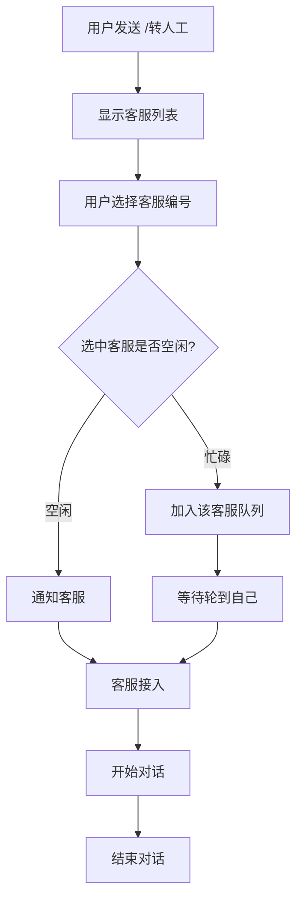

<div align="center">


# astrbot_plugin_human_service

_✨ [astrbot](https://github.com/AstrBotDevs/AstrBot) 人工客服插件 ✨_  

[](https://opensource.org/licenses/MIT)
[](https://www.python.org/)
[](https://github.com/Soulter/AstrBot)
[](https://github.com/Zhalslar)

**✨ 功能最丰富的 AstrBot 人工客服插件 ✨**
</div>

---
<div>

## 🎯 项目简介

`astrbot_plugin_human_service` 是一个功能强大的 AstrBot 人工客服插件，支持：

- ✅ **智能排队系统** - 客服忙碌时自动排队，避免同时服务多人
- ✅ **黑名单管理** - 拉黑骚扰用户，支持共用/独立模式
- ✅ **时间管理** - 对话和排队时间限制，超时自动处理
- ✅ **智能翻译** - 基于OpenAI的中英日三语实时翻译
- ✅ **客服名称** - 自定义客服显示名称，提升用户体验
- ✅ **消息定制** - 自定义前后缀，答非所问娱乐模式
- ✅ **活动沉默** - 独占模式，关闭其他插件和AI对话
- ✅ **聊天记录** - 导出对话记录，支持QQ合并转发格式

**当前版本：** v1.7.2  
**作者：** Zhalslar & Dongyue

---

## 📁 项目结构

```
astrbot_plugin_human_service/
├── main.py                      # 主插件类
│
├── managers/                    # 业务逻辑层
│   ├── __init__.py             # 管理器导出
│   ├── queue_manager.py        # 队列管理器
│   ├── blacklist_manager.py    # 黑名单管理器
│   ├── session_manager.py      # 会话管理器
│   ├── timeout_manager.py      # 超时管理器
│   ├── translation_service.py  # 翻译服务
│   ├── command_handler.py      # 命令处理器
│   └── silence_mode_manager.py # 沉默模式管理器
│
├── helpers/                     # 辅助工具层
│   ├── __init__.py             # 辅助工具导出
│   ├── help_text_builder.py    # 帮助文档构建器
│   ├── blacklist_formatter.py  # 黑名单格式化器
│   ├── chat_history_exporter.py# 聊天记录导出器
│   └── message_router.py       # 消息路由器
│
├── utils.py                     # 工具函数模块
├── _conf_schema.json            # 配置模式定义
├── metadata.yaml                # 插件元数据
├── README.md                    # 项目文档
└── LICENSE                      # MIT开源许可证
```

**代码特点：**
- 🏗️ 三层架构：主入口 → 业务逻辑 → 辅助工具
- 📦 模块化设计：12个独立模块，职责清晰
- 🎯 高质量代码：遵循SOLID原则，易于维护和扩展

---

## ✨ 功能特性

### 🎯 核心功能

#### 1. **智能排队系统** 
- 防止客服同时服务多人，确保服务质量
- 客服忙碌时用户自动加入排队
- 实时显示客服状态（🟢 空闲 / 🔴 忙碌中）
- 显示排队人数和位置
- 客服结束对话后自动接入下一位
- 支持查看排队状态和取消排队

#### 2. **黑名单管理** 
- 客服可拉黑骚扰用户
- 支持共用黑名单和独立黑名单两种模式
  - **共用模式**：一个客服拉黑，全部客服生效
  - **独立模式**：每个客服有自己的黑名单
- 支持查看、取消拉黑
- 被拉黑用户无法使用人工客服

#### 3. **时间管理系统** 
- **对话时间限制**：设置单次对话最大时长（秒）
- **排队时间限制**：设置最大排队等待时长（秒）
- **超时提醒**：对话即将结束前自动提醒
- **自动处理**：超时后自动结束对话并接入下一位

#### 4. **智能翻译系统** 
- 基于OpenAI API的AI翻译
- 支持中文、英文、日文
- 双向自动翻译（客服↔用户）
- 原文+译文同时发送
- 支持自定义API地址和模型
- 内置翻译测试功能

#### 5. **客服名称显示** 
- 为每个客服配置友好的显示名称
- 在选择列表、对话、记录中显示名称
- 提升用户体验

#### 6. **消息定制**
- **自定义前缀**：为客服消息添加前缀（如："亲"）
- **自定义后缀**：为客服消息添加后缀（如："~"）
- **答非所问模式**：娱乐功能，消息随机替换（如："哈基米"）

#### 7. **活动沉默模式** 
- 开启后关闭AI对话和其他插件
- 机器人仅响应人工客服命令
- 适用于纯人工客服场景
- 客服不受限制

#### 8. **聊天记录导出**
- 导出对话历史记录
- 支持QQ合并转发格式
- 支持文本格式
- 保存完整对话内容

#### 9. **智能帮助系统** 
- 使用 `/kfhelp` 查看所有命令
- 根据身份显示不同内容（用户/客服）
- 显示当前配置信息
- 清晰的命令说明和示例

---

## 📦 安装说明

### 方法一：插件市场安装（推荐）

```bash
# 在AstrBot插件市场搜索：astrbot_plugin_human_service
# 点击安装，等待安装完成
```

### 方法二：手动克隆

```bash
# 克隆仓库到插件目录
cd /AstrBot/data/plugins
git clone https://github.com/Zhalslar/astrbot_plugin_human_service

# 重启AstrBot
```

---

## ⚙️ 配置说明

### 基础配置

| 配置项 | 类型 | 默认值 | 说明 |
|:---:|:---:|:---:|:---|
| `servicers_id` | 列表 | [] | 客服QQ号列表，如：`["123456", "789012"]` |
| `servicers_names` | 列表 | [] | 客服名称列表（可选），如：`["客服小王", "客服小李"]` |
| `enable_servicer_selection` | 布尔 | true | 是否启用客服选择功能 |
| `enable_chat_history` | 布尔 | false | 是否启用聊天记录功能 |
| `enable_silence_mode` | 布尔 | false | 是否启用活动沉默模式 |

### 黑名单配置

| 配置项 | 类型 | 默认值 | 说明 |
|:---:|:---:|:---:|:---|
| `share_blacklist` | 布尔 | true | 多客服是否共用黑名单 |

### 消息定制配置

| 配置项 | 类型 | 默认值 | 说明 |
|:---:|:---:|:---:|:---|
| `message_prefix` | 字符串 | "" | 客服消息前缀，如：`"亲"` |
| `message_suffix` | 字符串 | "" | 客服消息后缀，如：`"~"` |
| `enable_random_reply` | 布尔 | false | 是否启用答非所问模式 |
| `random_reply_chars` | 字符串 | "哈基米" | 答非所问使用的字符 |

### 时间限制配置

| 配置项 | 类型 | 默认值 | 说明 |
|:---:|:---:|:---:|:---|
| `conversation_timeout` | 整数(秒) | 0 | 对话时间限制，0=不限制 |
| `queue_timeout` | 整数(秒) | 0 | 排队时间限制，0=不限制 |
| `timeout_warning_seconds` | 整数(秒) | 120 | 超时提前提醒时间 |

### 智能翻译配置

| 配置项 | 类型 | 默认值 | 说明 |
|:---:|:---:|:---:|:---|
| `enable_translation` | 布尔 | false | 是否启用智能翻译 |
| `translation_main_language` | 字符串 | "中文" | 主语言（中文/英文/日文） |
| `translation_target_language` | 字符串 | "英文" | 目标语言（中文/英文/日文） |
| `openai_api_key` | 字符串 | "" | OpenAI API Key |
| `openai_base_url` | 字符串 | "https://api.openai.com/v1" | OpenAI API地址 |
| `openai_model` | 字符串 | "gpt-3.5-turbo" | 使用的AI模型 |

### 配置示例

```json
{
  "servicers_id": ["123456789", "987654321"],
  "servicers_names": ["客服小王", "客服小李"],
  "enable_servicer_selection": true,
  "share_blacklist": true,
  "conversation_timeout": 1800,
  "queue_timeout": 900,
  "message_prefix": "亲",
  "message_suffix": "~",
  "enable_translation": false,
  "enable_silence_mode": false
}
```

---

## 📚 使用说明

### 用户命令

| 命令 | 说明 | 示例 |
|:---:|:---|:---|
| `/转人工` | 请求转接人工客服 | 发送 `/转人工` |
| `/转人机` | 取消请求或结束对话 | 发送 `/转人机` |
| `/取消排队` | 退出排队队列 | 发送 `/取消排队` |
| `/排队状态` | 查看排队位置 | 发送 `/排队状态` |
| `/kfhelp` | 显示帮助信息 | 发送 `/kfhelp` |

### 客服命令

| 命令 | 说明 | 示例 |
|:---:|:---|:---|
| `/接入对话` | 接入用户对话 | 回复用户消息后发送 `/接入对话` |
| `/拒绝接入` | 拒绝接入请求 | 回复用户消息后发送 `/拒绝接入` |
| `/结束对话` | 结束当前对话 | 对话中发送 `/结束对话` |
| `/拉黑 QQ号` | 拉黑指定用户 | `/拉黑 123456` |
| `/取消拉黑 QQ号` | 取消拉黑用户 | `/取消拉黑 123456` |
| `/查看黑名单` | 查看黑名单列表 | 发送 `/查看黑名单` |
| `/导出记录` | 导出聊天记录 | 对话中发送 `/导出记录` |
| `/翻译测试` | 测试翻译功能 | 发送 `/翻译测试` |
| `/kfhelp` | 显示完整帮助 | 发送 `/kfhelp` |

---

## 🔄 使用流程

### 场景1：单客服模式



**详细步骤：**

1. **用户请求转人工**
   ```
   用户: /转人工
   系统: 正在等待客服👤接入...  (客服空闲)
   或
   系统: 客服正在服务中🔴
         您已加入等待队列，当前排队人数：2
         您的位置：第 2 位
   ```

2. **客服接入**
   ```
   客服: (回复用户消息) /接入对话
   系统→用户: 客服【小王】已接入
   系统→客服: 好的，接下来我将转发你的消息给对方
   ```

3. **对话进行**
   ```
   用户: 你好，我想咨询一下...
   客服: (收到) 你好，我想咨询一下...
   
   客服: 你好，请问有什么可以帮您？
   用户: (收到) 亲你好，请问有什么可以帮您？~  (如果配置了前后缀)
   ```

4. **结束对话**
   ```
   客服: /结束对话
   系统→用户: 客服【小王】已结束对话
   系统→客服: ✅ 已结束对话
               📋 队列中的下一位用户已准备就绪...  (如果有排队)
   ```

---

### 场景2：多客服选择模式



**详细步骤：**

1. **选择客服**
   ```
   用户: /转人工
   系统: 请选择要对接的客服（回复序号）：
         1. 客服小王 🟢 空闲
         2. 客服小李 🔴 忙碌中（排队 1 人）
         3. 客服小张 🟢 空闲
         
         回复 0 取消请求
   
   用户: 1
   系统: 正在等待客服【小王】接入...
   ```

2. **后续流程同单客服模式**

---

### 场景3：客服拉黑用户

```
客服: /拉黑 123456
系统: ✅ 已将用户 123456 加入黑名单（全局）
      (如果用户正在对话，会立即结束)

用户(123456): /转人工
系统: ⚠ 您已被加入黑名单，无法使用人工客服
```

---

### 场景4：智能翻译

**配置：** 主语言=中文，目标语言=英文

```
用户(发英文): Hello, I need help
客服收到: Hello, I need help
         [翻译] 你好，我需要帮助

客服回复: 你好，有什么可以帮您？
用户收到: 你好，有什么可以帮您？
         [翻译] Hello, how can I help you?
```

---

### 场景5：活动沉默模式

```
配置: enable_silence_mode = true

普通用户: 你好
机器人: (无回应，因为AI被关闭)

普通用户: /转人工
机器人: 正在等待客服接入... (✅ 允许)

客服: 你好
机器人: (AI正常回复，客服不受限制)
```

---

## 🎮 完整使用流程示例

### 典型对话流程

```
=== 用户A请求转人工 ===
用户A: /转人工
系统: 正在等待客服👤接入...

=== 客服接入 ===
客服小王: (回复用户A消息) /接入对话
系统→用户A: 客服【小王】已接入 ⏰ 本次对话限时 1800 秒
系统→客服: 好的，接下来我将转发你的消息给对方
            ⏰ 对话限时 1800 秒

=== 用户B也想转人工（客服忙碌） ===
用户B: /转人工
系统: 客服正在服务中🔴
      您已加入等待队列，当前排队人数：1
      您的位置：第 1 位
      
      💡 使用 /取消排队 可退出队列

=== 正常对话 ===
用户A: 请问怎么使用这个功能？
客服小王: (收到) 请问怎么使用这个功能？

客服小王: 这个功能很简单...
用户A: (收到) 亲这个功能很简单...~  (前缀+后缀)

=== 超时提醒 ===
(对话进行到28分钟)
系统→用户A: ⏰ 提醒：对话将在 120 秒后自动结束，请抓紧时间沟通
系统→客服: ⏰ 提醒：与用户 xxx 的对话将在 120 秒后自动结束

=== 客服结束对话 ===
客服小王: /结束对话
系统→用户A: 客服【小王】已结束对话
系统→用户B: ⏰ 轮到您了！客服正在准备接入您的对话...
系统→客服: ✅ 已结束与用户 xxx 的对话
            📋 队列中的下一位用户已准备就绪：
            用户：用户B(xxx)
            请使用 /接入对话 命令开始服务
            （队列已清空）

=== 处理骚扰用户 ===
客服小王: /拉黑 999888
系统: ✅ 已将用户 999888 加入黑名单（全局）

用户(999888): /转人工
系统: ⚠ 您已被加入黑名单，无法使用人工客服
```

---

## ❓ 常见问题

### Q1: 如何设置客服？
**A:** 在插件配置中设置 `servicers_id` 列表。如果不设置，默认使用全局管理员作为客服。

### Q2: 客服选择和排队如何工作？
**A:** 
- 多客服时，用户可选择客服
- 客服忙碌时，用户自动加入该客服的队列
- 客服结束对话后，队列第一位自动准备接入

### Q3: 共用黑名单和独立黑名单的区别？
**A:**
- **共用**：一个客服拉黑，所有客服都无法接待该用户
- **独立**：每个客服有自己的黑名单，互不影响

### Q4: 时间限制如何设置？
**A:** 
- 在配置中设置秒数，如 `1800` 表示30分钟
- 设置为 `0` 表示不限制
- 建议：对话限时1800秒（30分钟），排队限时900秒（15分钟）

### Q5: 如何启用翻译功能？
**A:**
1. 设置 `enable_translation = true`
2. 填写 `openai_api_key`
3. 设置主语言和目标语言
4. 使用 `/翻译测试` 验证

### Q6: 活动沉默模式什么时候用？
**A:**
- 纯人工客服场景（不需要AI）
- 维护期间临时关闭AI
- 防止AI和人工客服冲突

---


## 🤝 贡献指南

- 🌟 **Star 这个项目**（点右上角星星）
- 🐛 **提交 Issue** 报告问题
- 💡 **提出建议** 新功能想法
- 🔧 **提交 PR** 改进代码

**插件反馈群（QQ群）**：460973561（不点star不给进）

---

## 📄 开源许可

本项目采用 [MIT License](LICENSE) 开源许可证。

---

## 👥 作者

- **原作者**: [Zhalslar](https://github.com/Zhalslar)
- **维护重构&功能迭代**: [Dongyue](https://github.com/wdjli)

## 🙏 致谢

感谢 [AstrBot](https://github.com/Soulter/AstrBot) 项目提供的优秀框架！


<div align="center">

**如果这个插件对你有帮助，请给个 ⭐ Star 支持一下！**

Made with ❤️ by Zhalslar & Dongyue

</div>
